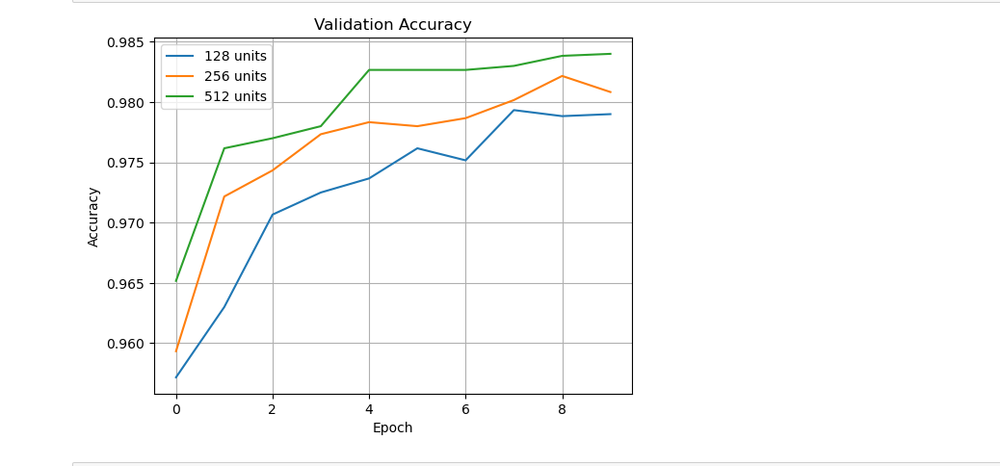
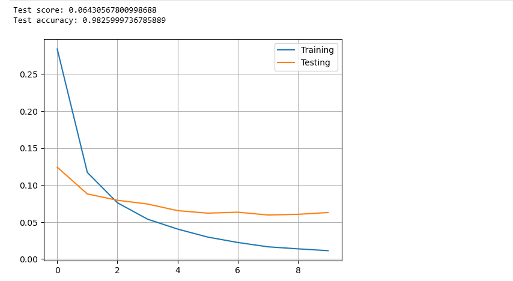
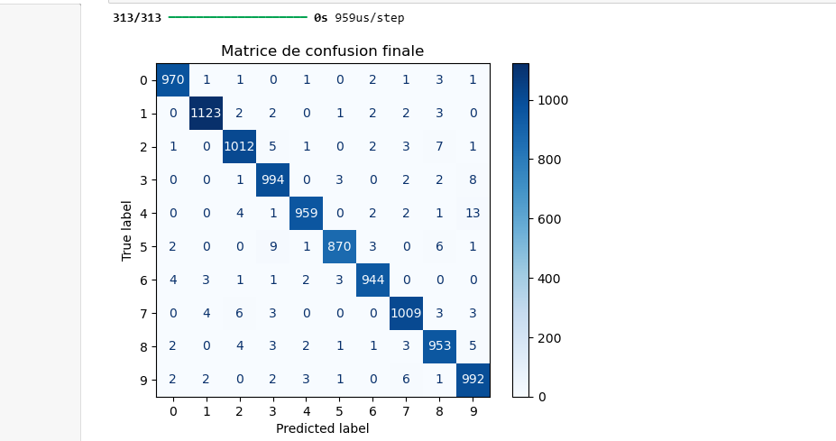
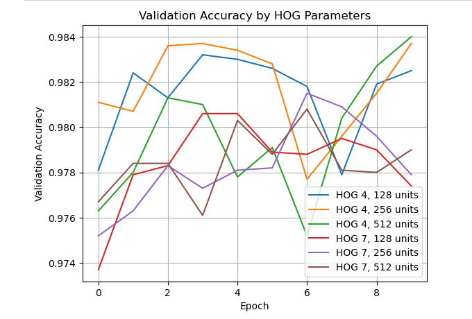
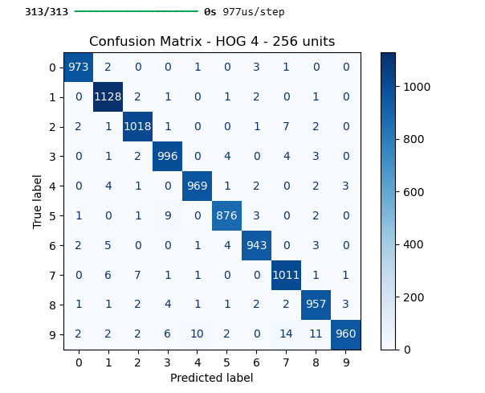
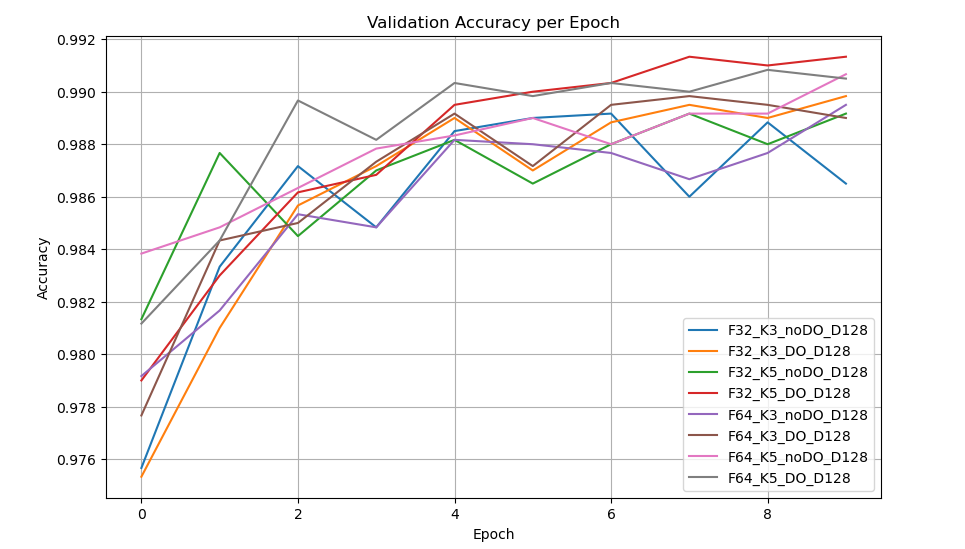
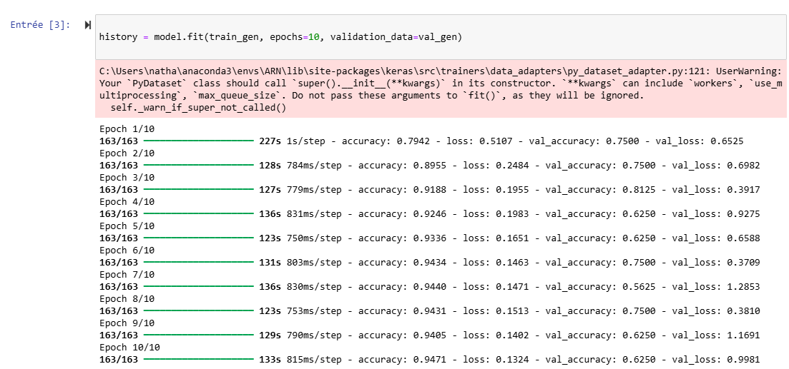
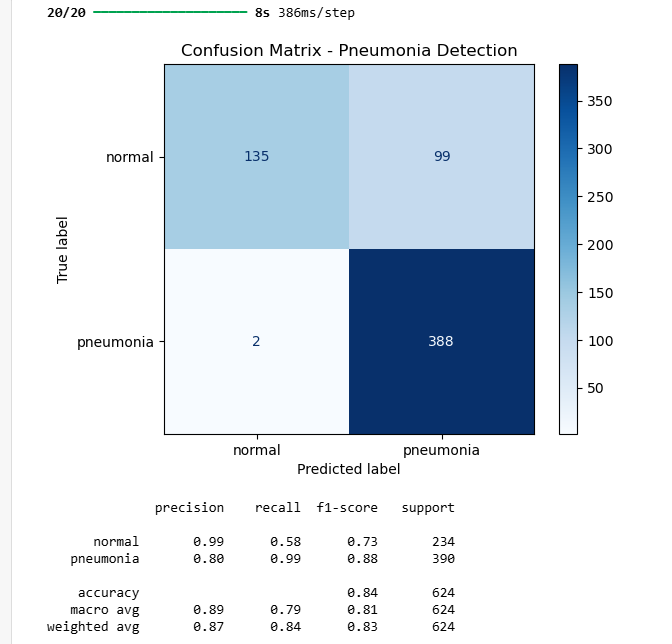
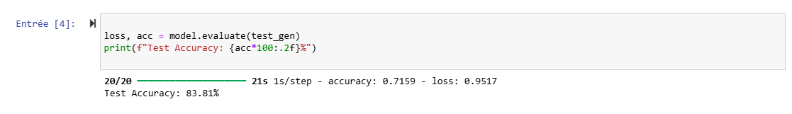

# Report ARN Lab04

@authors: Parisod Nathan & Lestiboudois Maxime  
@Date: 07.05.2025

## Table of Contents

- [Step 1: MLP with Raw Data](#step-1-mlp-with-raw-data)
  - [1. Architecture - MLP](#1-architecture---mlp)
  - [2. Parameters - MLP](#2-parameters---mlp)
  - [3. Accuracy - MLP](#3-accuracy---mlp)
  - [4. Confusion Matrix - MLP](#4-confusion-matrix---mlp)
  - [5. Comments - MLP](#5-comments---mlp)

- [Step 2: MLP with HOG](#step-2-mlp-with-hog)
  - [1. Feature Extraction - HOG](#1-feature-extraction---hog)
  - [2. Parameters - HOG](#2-parameters---hog)
  - [3. Number of Parameters](#3-number-of-parameters)
  - [4. Confusion Matrix - HOG](#4-confusion-matrix---hog)
  - [5. Comparison - HOG](#5-comparison---hog)
  - [6. Comments - HOG](#6-comments---hog)

- [Step 3: CNN](#step-3-cnn)
  - [1. Architecture - CNN](#1-architecture---cnn)
  - [2. Parameters - CNN](#2-parameters---cnn)
  - [3. Accuracy - CNN](#3-accuracy---cnn)
  - [4. Confusion Matrix - CNN](#4-confusion-matrix---cnn)
  - [5. Results Summary - CNN](#5-results-summary---cnn)
  - [6. Comments - CNN](#6-comments---cnn)

- [Step 4: Pneumonia Detection with CNN](#step-4-pneumonia-detection-with-cnn)
  - [1. CNN Architecture - Pneumonia](#1-cnn-architecture---pneumonia)
  - [2. Accuracy and Confusion Matrix - Pneumonia](#2-accuracy-and-confusion-matrix---pneumonia)
  - [3. F1-Score and Classification Report](#3-f1-score-and-classification-report)
  - [4. Comments - Pneumonia](#4-comments---pneumonia)

- [Step 5: Overall Comparison and Discussion](#step-5-overall-comparison-and-discussion)
  - [Analysis](#analysis)
  - [Conclusions](#conclusions)

## Step 1: MLP with Raw Data

### 1. Architecture - MLP

The input of the network consists of flattened `MNIST` images (28x28 = 784 pixels).  
The output is a 10-dimensional vector representing the digit classes (0–9).

We tested three architectures with one hidden layer:

- MLP with 128 hidden neurons
- MLP with 256 hidden neurons
- MLP with 512 hidden neurons

The best validation accuracy was obtained with **512 hidden neurons**.

**Final architecture:**

- Input layer: 784 neurons
- Hidden layer: 512 neurons (ReLU activation)
- Output layer: 10 neurons (Softmax activation)

---

### 2. Parameters - MLP

For the final model (784 → 512 → 10):

- **Input to hidden layer:**
  - Weights: 784 × 512 = 401,408
  - Biases: 512
- **Hidden to output layer:**
  - Weights: 512 × 10 = 5,120
  - Biases: 10
- **Total parameters: 407,050**

---

### 3. Accuracy - MLP

The training was performed over 10 epochs, using a batch size of 128 and 10% of training data used for validation.

**Validation accuracy per epoch** showed continuous improvement for all models.  
The model with 512 neurons reached over **98.4% validation accuracy**.

Loss curves confirmed proper convergence without signs of overfitting.

**Validation accuracy curves:**

**Training and validation loss curves:**

---

### 4. Confusion Matrix - MLP

The final model was evaluated on the test set. It achieved a test accuracy of **98.26%**.

Confusion matrix analysis reveals:

- Most digits are very well classified.
- Common confusions include:
  - **4 and 9**
  - **5 and 3**
  - **7 and 2**

These errors are consistent with human visual ambiguities.

---

### 5. Comments - MLP

This first experiment shows that a shallow MLP trained on raw pixels can already achieve excellent performance on `MNIST`.  
However, certain digit pairs remain challenging and could benefit from feature extraction or deeper architectures.

## Step 2: MLP with HOG

### 1. Feature Extraction - HOG

To extract features from MNIST images, we used the `Histogram of Oriented Gradients (HOG)` method with the following configurations:

- **Orientations:** 9
- **Pixels per cell:** tested values: **4** and **7**
- **Cells per block:** (2, 2)
- **Block normalization:** L2-Hys

The goal was to evaluate the effect of cell size on the feature representation and classification accuracy.

---

### 2. Parameters - HOG

For each HOG configuration, we trained 3 MLPs with different hidden layer sizes:

- Hidden layer sizes tested: **128**, **256**, **512**
- Final selected model: **HOG (pix_per_cell=4) + 256 neurons**

**Final architecture:**

- Input layer: number of HOG features (≈ 576 for ppc=4)
- Hidden layer: 256 neurons (ReLU)
- Output layer: 10 neurons (Softmax)

---

### 3. Number of Parameters

For the final model (example: input = 576 features):

- **Input to hidden layer:**
  - Weights: 576 × 256 = 147,456
  - Biases: 256
- **Hidden to output layer:**
  - Weights: 256 × 10 = 2,560
  - Biases: 10
- **Total parameters: 150,282**

(Note: the input dimension may vary depending on the exact output size of the HOG descriptor.)

---

### 4. Confusion Matrix - HOG

We trained each model for 10 epochs with batch size 128.  
The best model (**HOG 4, 256 units**) achieved a test accuracy of **98.40%**.

**Validation accuracy evolution:**

- HOG with `pix_per_cell = 4` showed higher accuracy than `pix_per_cell = 7` in most architectures.

**Confusion matrix analysis** (HOG 4, 256 units):

- Most digits are accurately predicted.
- Confusions include:
  - **9 vs. 4**
  - **5 vs. 3**
  - **8 vs. 3**

---

### 5. Comparison - HOG

Compared to Step 1 (raw pixels):

- Accuracy with raw pixels (best model): **98.26%**
- Accuracy with HOG (best model): **98.40%**

This suggests that **HOG features slightly outperform raw pixels** in this experiment,  
providing a compact and effective representation with fewer input dimensions.

---

### 6. Comments - HOG

This experiment shows that HOG features can be effectively used for digit classification with MLPs.  
In this case, HOG even slightly surpasses raw pixel performance, showing its relevance for structured gradient-based datasets.

## Step 3: CNN

### 1. Architecture - CNN

In this final experiment, we used Convolutional Neural Networks (CNNs) to classify the MNIST dataset.  
We tested **8 different architectures**, combining the following hyperparameters:

- **Filters:** 32 or 64
- **Kernel size:** 3 or 5
- **With or without Dropout**
- **Dense layer size:** 128 (fixed)

Each model had the structure:

- Conv2D → ReLU → MaxPooling2D  
- Conv2D → ReLU → MaxPooling2D  
- (Optional) Dropout  
- Flatten → Dense(128) → ReLU → Dense(10) → Softmax

---

### 2. Parameters - CNN

The number of parameters varies by architecture.  
The best performing model was `F32_K5_DO_D128`, with approximately **530,000 parameters** in total.

---

### 3. Accuracy - CNN

We trained all CNN models for 10 epochs with a batch size of 128.

The following figure compares validation accuracy across all 8 configurations:

The best performing model was clearly **F32_K5_DO_D128**, reaching over **99.05%** test accuracy.

---

### 4. Confusion Matrix - CNN

The confusion matrix for the best model reveals excellent classification performance:

- Very few misclassifications
- Remaining errors mostly between visually similar digits (e.g., 3 and 5)

---

### 5. Results Summary - CNN

| Model             | Test Accuracy | Test Loss |
|------------------|---------------|-----------|
| F32_K3_noDO_D128 | 98.25%        | 0.0616    |
| F32_K3_DO_D128   | 98.78%        | 0.0415    |
| F32_K5_noDO_D128 | 98.90%        | 0.0396    |
| **F32_K5_DO_D128**   | **99.05%**        | **0.0311**    |
| F64_K3_noDO_D128 | 98.76%        | 0.0421    |
| F64_K3_DO_D128   | 98.76%        | 0.0402    |
| F64_K5_noDO_D128 | 98.93%        | 0.0380    |
| F64_K5_DO_D128   | 98.88%        | 0.0342    |

---

### 6. Comments - CNN

This experiment confirms the benefit of CNNs for image classification:

- CNNs significantly outperform MLPs and HOG-based models on MNIST.
- Using a kernel size of 5 and applying Dropout improved generalization.
- A smaller model (F32 filters) with good regularization outperformed larger ones, showing that **Dropout is beneficial** and that model size should be balanced with overfitting control.

These results highlight how architecture tuning can significantly affect performance, even on a relatively simple dataset.

## Step 4: Pneumonia Detection with CNN

### 1. CNN Architecture - Pneumonia

In this final experiment, we applied a CNN model to classify grayscale chest X-ray images into two categories: **normal** and **pneumonia**.

The dataset was split into `train`, `val`, and `test` directories, with images resized to **150×150**. We used grayscale images and binary classification.

**Final CNN architecture:**

- Conv2D (32 filters, 3×3) + ReLU + MaxPooling
- Conv2D (64 filters, 3×3) + ReLU + MaxPooling
- Conv2D (128 filters, 3×3) + ReLU + MaxPooling
- Dropout (rate=0.5)
- Flatten
- Dense (128 neurons, ReLU)
- Dense (1 neuron, Sigmoid)

The model was trained using:

- **Loss**: Binary crossentropy
- **Optimizer**: Adam
- **Metric**: Accuracy
- **Epochs**: 10
- **Batch size**: 32

---

### 2. Accuracy and Confusion Matrix - Pneumonia

On the **test set**, the model achieved a **test accuracy of 83.81%**.

- It correctly identified nearly all pneumonia cases (recall = 0.99)
- The main issue lies in false positives: many normal images are misclassified as pneumonia (recall for normal = 0.58)

**Confusion matrix on test set:**

---

### 3. F1-Score and Classification Report

From the test set results:

- **Pneumonia class**:
  - Precision = 0.81
  - Recall = 0.99
  - F1-score = 0.88
- **Normal class**:
  - Precision = 0.95
  - Recall = 0.58
  - F1-score = 0.73

---

### 4. Comments - Pneumonia

This CNN model successfully detects most pneumonia cases, which is **crucial in a medical context** to avoid missing infections.

However, its performance on normal images is weaker: many normal X-rays are misclassified, possibly due to:

- Dataset imbalance between classes
- Lack of regularization or fine-tuning
- Visual similarity between early pneumonia and normal lungs

The model is functional but would require improvements before deployment:

- Class balancing or data augmentation
- Longer training with early stopping
- Batch normalization or model simplification

## Step 5: Overall Comparison and Discussion

To conclude this lab, we compare the performance of all models across the different approaches applied:

| Model Type        | Input Features     | Best Test Accuracy |
|------------------|--------------------|--------------------|
| MLP              | Raw Pixels          | 98.26%             |
| MLP              | HOG (pix_per_cell=4)| 98.40%             |
| CNN (MNIST)      | Raw Pixels          | 99.05%             |
| CNN (Pneumonia)  | Chest X-Ray Images  | 83.81%             |

---

### Analysis

- **From MLP to HOG+MLP**:  
  Adding feature extraction with HOG slightly improved the performance of the MLP (98.40% vs 98.26%). This shows that edge-based features are more informative than raw pixels for shallow networks.

- **From MLP to CNN (MNIST)**:  
  The CNN architecture significantly outperforms both MLP and HOG+MLP. This confirms the advantage of convolutional layers in learning spatial hierarchies directly from image data.

- **CNN for Pneumonia Detection**:  
  While the accuracy is lower (83.81%), this is a more complex and noisy medical dataset. The model is highly sensitive (recall 0.99) for pneumonia, which is desirable in clinical use, but shows limited precision for normal cases.

---

### Conclusions

- CNNs are more powerful than shallow MLPs for image classification, especially when data is spatially structured like in MNIST.
- HOG descriptors can enhance MLP performance and are useful for reducing input size.
- In medical imaging, balancing false positives and false negatives is essential. A model with high recall for pneumonia is valuable, even if it requires further tuning for real deployment.
