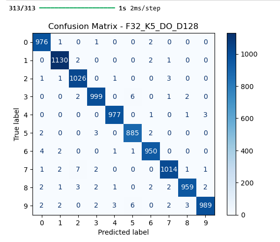

# Report ARN Lab04

@authors: Parisod Nathan & Lestiboudois Maxime  
@Date: 07.05.2025

## Step 1: MLP with Raw Data

### 1. Architecture - MLP

The input of the network consists of flattened `MNIST` images (28x28 = 784 pixels).  
The output is a 10-dimensional vector representing the digit classes (0–9).

We tested three architectures with one hidden layer:

- MLP with 128 hidden neurons
- MLP with 256 hidden neurons
- MLP with 512 hidden neurons

The best validation accuracy was obtained with **512 hidden neurons**.

**Final architecture:**

- Input layer: 784 neurons
- Hidden layer: 512 neurons (ReLU activation)
- Output layer: 10 neurons (Softmax activation)

---

### 2. Parameters - MLP

For the final model (784 → 512 → 10):

- **Input to hidden layer:**
  - Weights: 784 × 512 = 401,408
  - Biases: 512
- **Hidden to output layer:**
  - Weights: 512 × 10 = 5,120
  - Biases: 10
- **Total parameters: 407,050**

---

### 3. Accuracy - MLP

The training was performed over 10 epochs, using a batch size of 128 and 10% of training data used for validation.

**Validation accuracy per epoch** showed continuous improvement for all models.  
The model with 512 neurons reached over **98.4% validation accuracy**.

Loss curves confirmed proper convergence without signs of overfitting.

**Validation accuracy curves:**

**Training and validation loss curves:**

---

### 4. Confusion Matrix - MLP

The final model was evaluated on the test set. It achieved a test accuracy of **98.26%**.

Confusion matrix analysis reveals:

- Most digits are very well classified.
- Common confusions include:
  - **4 and 9**
  - **5 and 3**
  - **7 and 2**

These errors are consistent with human visual ambiguities.

---

### 5. Comments - MLP

This first experiment shows that a shallow MLP trained on raw pixels can already achieve excellent performance on `MNIST`.  
However, certain digit pairs remain challenging and could benefit from feature extraction or deeper architectures.

## Step 2: MLP with HOG

### 1. Feature Extraction - HOG

To extract features from MNIST images, we used the `Histogram of Oriented Gradients (HOG)` method with the following configurations:

- **Orientations:** 9
- **Pixels per cell:** tested values: **4** and **7**
- **Cells per block:** (2, 2)
- **Block normalization:** L2-Hys

The goal was to evaluate the effect of cell size on the feature representation and classification accuracy.

---

### 2. Parameters - HOG

For each HOG configuration, we trained 3 MLPs with different hidden layer sizes:

- Hidden layer sizes tested: **128**, **256**, **512**
- Final selected model: **HOG (pix_per_cell=4) + 256 neurons**

**Final architecture:**

- Input layer: number of HOG features (≈ 576 for ppc=4)
- Hidden layer: 256 neurons (ReLU)
- Output layer: 10 neurons (Softmax)

---

### 3. Number of Parameters

For the final model (example: input = 576 features):

- **Input to hidden layer:**
  - Weights: 576 × 256 = 147,456
  - Biases: 256
- **Hidden to output layer:**
  - Weights: 256 × 10 = 2,560
  - Biases: 10
- **Total parameters: 150,282**

(Note: the input dimension may vary depending on the exact output size of the HOG descriptor.)

---

### 4. Confusion Matrix - HOG

We trained each model for 10 epochs with batch size 128.  
The best model (**HOG 4, 256 units**) achieved a test accuracy of **98.40%**.

**Validation accuracy evolution:**

- HOG with `pix_per_cell = 4` showed higher accuracy than `pix_per_cell = 7` in most architectures.

**Confusion matrix analysis** (HOG 4, 256 units):

- Most digits are accurately predicted.
- Confusions include:
  - **9 vs. 4**
  - **5 vs. 3**
  - **8 vs. 3**

---

### 5. Comparison - HOG

Compared to Step 1 (raw pixels):

- Accuracy with raw pixels (best model): **98.26%**
- Accuracy with HOG (best model): **98.40%**

This suggests that **HOG features slightly outperform raw pixels** in this experiment,  
providing a compact and effective representation with fewer input dimensions.

---

### 6. Comments - HOG

This experiment shows that HOG features can be effectively used for digit classification with MLPs.  
In this case, HOG even slightly surpasses raw pixel performance, showing its relevance for structured gradient-based datasets.

## Step 3: CNN

### 1. Architecture - CNN

In this final experiment, we used Convolutional Neural Networks (CNNs) to classify the MNIST dataset.  
We tested **8 different architectures**, combining the following hyperparameters:

- **Filters:** 32 or 64
- **Kernel size:** 3 or 5
- **With or without Dropout**
- **Dense layer size:** 128 (fixed)

Each model had the structure:

- Conv2D → ReLU → MaxPooling2D  
- Conv2D → ReLU → MaxPooling2D  
- (Optional) Dropout  
- Flatten → Dense(128) → ReLU → Dense(10) → Softmax

---

### 2. Parameters - CNN

The number of parameters varies by architecture.  
The best performing model was `F32_K5_DO_D128`, with approximately **530,000 parameters** in total.

---

### 3. Accuracy - CNN

We trained all CNN models for 10 epochs with a batch size of 128.

The following figure compares validation accuracy across all 8 configurations:

The best performing model was clearly **F32_K5_DO_D128**, reaching over **99.05%** test accuracy.

---

### 4. Confusion Matrix - CNN

The confusion matrix for the best model reveals excellent classification performance:

- Very few misclassifications
- Remaining errors mostly between visually similar digits (e.g., 3 and 5)

---

### 5. Results Summary - CNN

| Model             | Test Accuracy | Test Loss |
|------------------|---------------|-----------|
| F32_K3_noDO_D128 | 98.25%        | 0.0616    |
| F32_K3_DO_D128   | 98.78%        | 0.0415    |
| F32_K5_noDO_D128 | 98.90%        | 0.0396    |
| **F32_K5_DO_D128**   | **99.05%**        | **0.0311**    |
| F64_K3_noDO_D128 | 98.76%        | 0.0421    |
| F64_K3_DO_D128   | 98.76%        | 0.0402    |
| F64_K5_noDO_D128 | 98.93%        | 0.0380    |
| F64_K5_DO_D128   | 98.88%        | 0.0342    |

---

### 6. Comments - CNN

This experiment confirms the benefit of CNNs for image classification:

- CNNs significantly outperform MLPs and HOG-based models on MNIST.
- Using a kernel size of 5 and applying Dropout improved generalization.
- A smaller model (F32 filters) with good regularization outperformed larger ones, showing that **Dropout is beneficial** and that model size should be balanced with overfitting control.

These results highlight how architecture tuning can significantly affect performance, even on a relatively simple dataset.

## Step 4 TODO
